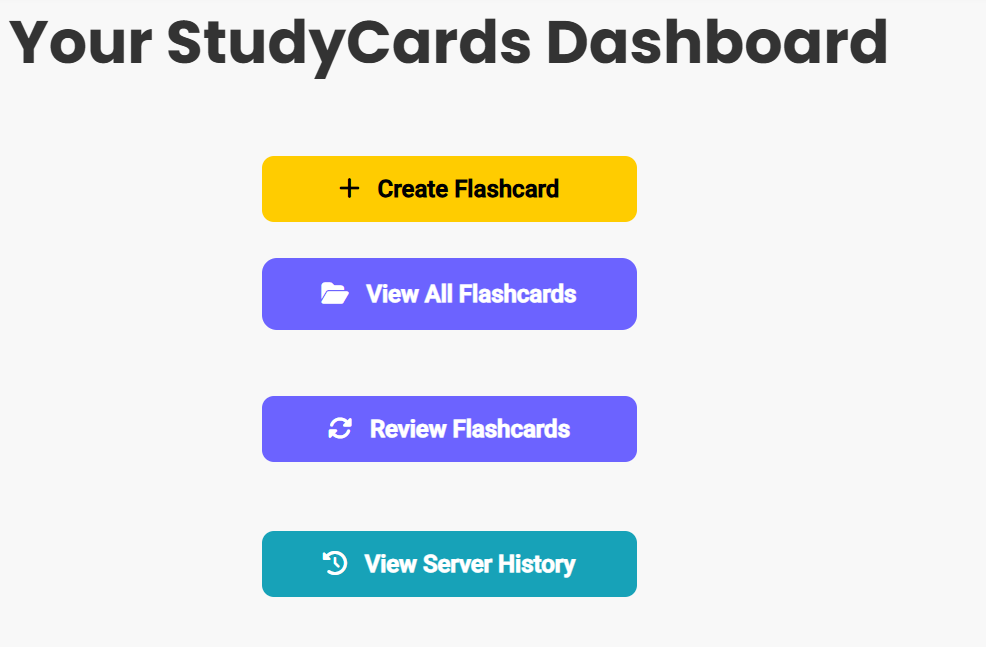
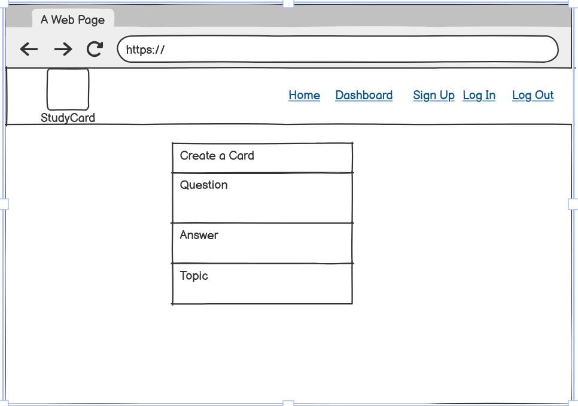

# Study Cards App
## Site Preview

Visit the deployed site: [Study Cards App](https://study-cards-frontend-2200912dd99e.herokuapp.com/)

## Overview

**StudyCards** is a web-based application designed to help users study and retain information more efficiently using digital flashcards.  
It offers a simple, intuitive, and responsive interface where users can create, organize, review, and track their learning progress.The app is suitable for anyone aiming to improve their knowledge retention.  

Key highlights include:

- Secure user registration and login system
- Personalized dashboard for quick access to learning tools
- Ability to create, edit, delete, and filter flashcards
- Review mode with instant results and progress tracking
- Full responsiveness across mobile, tablet, and desktop devices

StudyCards is built using a **React.js** front-end and a **Django REST Framework** .

---

## Index

- [Project Description](#project-description)
- [Main Goals](#main-goals)
- [User Goals](#user-goals)
- [Site Owner Goals](#site-owner-goals)
- [Features](#features)
  - [Favicon](#favicon)
  - [Navigation Bar](#navigation-bar)
  - [Footer](#footer)
  - [Home Page](#home-page)
  - [Register Page](#register-page)
  - [Login Page](#login-page)
  - [Dashboard Page](#dashboard-page)
  - [Create Flashcard Page](#create-flashcard-page)
  - [Edit Flashcard Page](#edit-flashcard-page)
  - [Flashcards List Page](#flashcards-list-page)
  - [Review Flashcards Page](#review-flashcards-page)
  - [Review History Page](#review-history-page)
  - [Not Found (404) Page](#not-found-404-page)
- [Future Implementations](#future-implementations)
- [Design](#design)
  - [Wireframes](#wireframes)
  - [Colour Scheme](#colour-scheme)
  - [Typography](#typography)
- [Testing](#testing)
- [Deployment](#deployment)
  - [Heroku Deployment](#heroku)
  - [Fork Repository](#fork-repository)
  - [Local Clones](#local-clones)
- [Credits](#credits)
  - [Technologies Used](#technologies-used)
  - [References](#references)

## Project Description

**StudyCards** is a full-stack web application that empowers users to create, manage, and review flashcards to boost memory retention and learning efficiency. The has been built with **React** (front-end) and **Django REST Framework** (back-end). The project is designed with scalability and future enhancements in mind.

---

## Main Goals

- Provide a simple and intuitive platform for users to create, review, and manage flashcards.
- Support users in developing strong, long-term memory retention through regular practice.
- Ensure the application is responsive and accessible across devices (desktop, tablet, mobile).
- Build a scalable foundation for implementing advanced learning techniques in future updates.

## User Goals

- Easily register, log in, and manage a personalised collection of flashcards.
- Quickly create new flashcards categorised by topic and learning status.
- Review flashcards effectively through a user-friendly interface with progress tracking.
- Access the platform from any device to study on the go.

## Site Owner Goals

- Provide a reliable, secure, and professional service that encourages repeat use.
- Collect feedback for future improvements like spaced repetition or deck creation.
- Grow the user base.

## Features

### Favicon

**Custom Favicon**

A personalized favicon has been added to enhance branding and improve user experience in the browser tab.

**Details**:
- The favicon is a simplified version of the StudyCards logo.
- It helps distinguish the tab visually among others.

### Navigation Bar

- Navigation bar - large screen - signed user

- Navigation bar - large screen - not signed user

- Navigation bar - small screen 

- Navigation bar - logo

The **StudyCards** app features a responsive navigation bar located at the top of every page. It provides quick access to the main sections of the StudyCards app and dynamically updates based on the user's authentication status.

Navbar displays:

- **Logo**:
  - Displays the StudyCards logo on the left side.
  - Clicking the logo redirects the user back to the **Home** page.

- **When logged out**:
  - Navigation links available: **Home**, **Log In**, and **Register**.

- **When logged in**:
  - Navigation links available: **Home** and **Dashboard**.
  - A personalized **greeting** appears (e.g., "Hi, username!").
  - A **Log Out** button is displayed to end the session.

- **Responsive design**:
  - On smaller screens (mobile and tablets), the Navbar **collapses** into a hamburger menu for better accessibility.
  - The menu can be expanded/collapsed to navigate between sections easily.

- **Technologies**:
- Built using **React Bootstrap Navbar** for responsive behavior.
- **Font Awesome** icons are used next to navigation links to enhance visual clarity.

### Footer

The footer is pinned to the bottom of the page,  it displays:

- A set of social media icons (Facebook, Twitter, Instagram). 
- Hover effects for icons, changing their color upon interaction to enhance user feedback.
- When clicked redirects to the relevant social media site.

This design ensures that users can always access key information about our application and follow us on social platforms, regardless of where they are on the page.

### Home Page

The Home Page serves as the welcoming entry point for both new and returning users.

### Key Features:
- **Dynamic Content Based on Authentication**:
  - If the user is **not logged in**, the page displays:
    - A brief description of StudyCards benefits.
    - A call-to-action button to **Register**.
    - A secondary link for existing users to **Log In**.
  - If the user is **logged in**, the authentication section is hidden, keeping the layout clean.

- **About Section**:
  - Clear explanation of what StudyCards is and how it helps users to improve their memory and study routines.

- **Steps Section**:
  - An ordered list outlining the simple process:
    1. Create flashcards.
    2. Review and track your progress.
    3. Master topics over time.

### Visual Elements:
- Icon on the **Get Started** button for visual engagement.
- Clear, friendly language that encourages users to take the next step.

## Register Page

The Register Page allows new users to easily create a StudyCards account.

### Key Features:
- **User Registration**:
  - A form with fields for:
    - **Username**
    - **Email**
    - **Password**
    - **Password Confirmation**
  - All fields are validated to ensure they meet the requirements before submission.

- **Password Requirements**:
  - Password must:
    - Be at least 8 characters long.
    - Include uppercase and lowercase letters.
    - Include at least one number.
    - Allow special characters.
  - A helpful password guideline is displayed below the form.

- **Post-Registration Actions**:
  - After successful registration:
    - The user is redirected to the **Home** page.
    - Encouraged to log in.

- **Error Handling**:
  - Comprehensive error messages covering:
    - Validation issues.
    - Network issues.
    - Server-side errors.

## Login Page

The Login Page allows returning users to securely access their StudyCards account.

### Key Features:
- **User Authentication**:
  - A clean form with fields for **Username** and **Password**.
  - Validation to ensure required fields are filled before submission.
  - Shows a loading indicator ("Logging you in, please wait...") during the authentication process.
  - After successful login redirects the user automatically to the **Dashboard**.

## Dashboard Page

The Dashboard Page acts as the central hub for logged-in users, giving quick access to key StudyCards features.

### Key Features:
- **User Access**:
  - Only available to authenticated (logged-in) users.

- **Navigation Buttons**:
  - **Create Flashcard**: Direct link to add a new flashcard.
  - **View All Flashcards**: View and manage all created flashcards.
  - **Review Flashcards**: Start a flashcard review session.
  - **View Server History**: View past review session statistics stored on the server.

## Create Flashcard Page

The Create Flashcard Page allows users to easily add new flashcards to their collection for future review.

### Key Features:
- **Form Fields**:
  - **Question**: Text input for the flashcard's question (required).
  - **Answer**: Text input for the flashcard's answer (required).
  - **Topic**: Optional text input to categorize the flashcard.
  - **Status**: Dropdown menu with three options:
    - `New`
    - `Reviewing`
    - `Mastered`
  - **Default Status**: New flashcards are assigned a "New" status unless changed manually.

### Visual Elements:
-  Simple and intuitive form structure.
-  Organized inputs for managing flashcard data.
-  Smooth redirection and feedback after flashcard creation.

## Edit Flashcard Page

The Edit Flashcard Page allows users to update an existing flashcard's details, helping them keep their study materials accurate and up-to-date.

### Key Features:
- **Prefilled Form Fields**:
  - When the page loads, it fetches the current flashcard data (question, answer, topic, status) and pre-fills the form fields.
  
- **Editable Fields**:
  - **Question**: Text input field for modifying the flashcard question.
  - **Answer**: Text input field for modifying the flashcard answer.
  - **Topic**: Optional text input for updating the topic category.
  - **Status**: Dropdown menu to update the flashcard’s learning status:
    - `New`
    - `Reviewing`
    - `Mastered`

- **Form Handling**:
  - User can modify one or multiple fields.
  - Form validation ensures required fields (question and answer) are not left blank.
  - Displays meaningful error messages if the update fails.
  - Redirects user to the Flashcards List after successful update.

## Flashcards List Page

The Flashcards List Page provides users with an organized overview of all their created flashcards. Users can easily view, filter, edit, and delete their flashcards from this page.

### Key Features:
- **Flashcard Overview**:
  - Displays each flashcard with its **Question**, **Answer**, **Topic**, and **Status**.

- **Filtering Options**:
  - **Filter by Topic**: Dropdown menu allows users to view flashcards related to a specific topic.
  - **Filter by Status**: Dropdown to filter flashcards by their learning status:
    - `New`
    - `Reviewing`
    - `Mastered`
  - **Clear Filters**: Button to reset all applied filters and show all flashcards.

- **CRUD Actions**:
  - **Edit**: Button for each flashcard redirects users to an edit form where they can update flashcard details.
  - **Delete**: Button prompts for confirmation before permanently deleting a flashcard from the system.

- **Create New Flashcard**:
  - A dedicated button at the top to navigate users directly to the Create Flashcard page.

- **Empty State Handling**:
  - Displays a helpful message if no flashcards match the selected filters.
  - Encourages users to add new flashcards if none exist.

## Review Flashcards Page

The Review Flashcards Page enables users to practice memorising their flashcards.

### Key Features:
- **Smart Review Flow**:
  - Flashcards are displayed one at a time.
  - Clicking on a card flips it to show the answer.
  - After viewing the answer, users can mark their response as **Correct** or **Incorrect**.

- **Streak Tracking**:
  - A dynamic "Current Streak" counter shows how many correct answers the user has given in a row.
  - Encourages consistent learning habits through positive reinforcement.

- **Session Completion Summary**:
  - After finishing the review session, a summary is displayed:
    - Total correct answers
    - Total flashcards reviewed
    - Final score as a percentage
  - Options to:
    -  Review Again
    -  Return to Flashcards List
    -  Return to Home Page

- **Filtering Options**:
  - Users can filter flashcards before starting a review:
    - **By Topic**: Focus on a specific subject.
    - **By Status**: Focus on flashcards based on their learning progress (`New`, `Reviewing`, `Mastered`).
  - **Clear Filters** button available to reset selections.

- **Shuffle Logic**:
  - Flashcards are shuffled to avoid memorising card order.

## Review History Page

The Review History Page allows users to track their past study sessions.

### Key Features:
- **Session Records**:
  - Displays a table of all review sessions saved on the server.
  - Each entry includes:
    - **Date** and Time of the review
    - **Score** (%) achieved
    - **Correct** answers
    - **Total** questions answered

- **Navigation**:
  - After reviewing history, users can easily return:
    -  **Back to Home** button available.

## Not Found (404) Page

The Not Found Page provides a user-friendly message when a user tries to access an invalid or non-existent route within the application.

### Key Features:
- **Error Display**:
  - Shows a clear and bold **404** error code.
  - Displays a polite error message:  
    _"Sorry, the page you requested could not be found."_

- **Navigation Assistance**:
  - Provides a prominent link to guide users back to the Home Page:
    -  **Back to Home** button with a FontAwesome home icon.

## Future Implementations

Here are some planned enhancements to further improve the StudyCards app:

1. **Spaced Repetition**  
   Implement an intelligent review system that schedules flashcard reviews based on the user's performance and memory retention.

2. **Deck Organisation**  
   Allow users to group flashcards into customizable decks.

3. **Flashcard Tags and Search**  
   Introduce tagging functionality and an advanced search bar so users can quickly find specific flashcards based on keywords, topics, or difficulty levels.

4. **Progress Tracking Dashboard**  
   Expand the Dashboard with visual analytics (e.g., charts) to display user progress, improvement trends, mastery rates per deck, and areas needing more practice.

---

## Design

### Wireframes

### Colour Scheme

The following colour palette has been used throughout the StudyCards website:

- **#F4F7FC**: Background color for the body, providing a light and clean look.
- **#FFFFFF**: Background for cards, forms, and containers to maintain clarity and focus.
- **#FFC107**: Primary button color (e.g., "Save Flashcard", "Submit").
- **#E0A800**: Button hover effect, providing a smooth, interactive transition.
- **#333333**: Primary text color for strong readability against light backgrounds.
- **#666666**: Secondary text color used for less important information, ensuring visual hierarchy.
- **#FF4C4C**: Error and alert messages (e.g., failed login, form validation errors) to grab attention.
- **#28A745**: Success messages and indicators (e.g., successful login or registration).
- **#17A2B8**: Highlight elements such as info banners or links for a friendly and modern feel.

### Typography
The website uses the following font styles for its design:
- **Roboto**: Used as the general font for the body text across the site.
- **Poppins**: Applied to headings (h1, h2, h3, h4) to draw attention and clearly separates titles and important sections.
- **Rubik**: Used for special or secondary text to add visual contrast and highlight accent information without overpowering the main content.
- **Fira Code**: Chosen for code blocks to enhance readability and clarity.

## Testing

Detailed information about testing is available in the [Testing Documentation](TESTING.md).

## Deployment

### Heroku

The Application has been deployed from GitHub to Heroku by following these steps:

1. Create or log in to your account at heroku.com.
2. Create a new app, add a unique app name and choose your region.
3. Click on create app.
4. Go to "Settings".
5. Under Config Vars add a key 'PORT' and value '8000'.
6. Add required buildpacks.
7. Go to "Deploy" and select "GitHub" in "Deployment method".
8. Enter your repository name, click 'Search' and then 'Connect'.
9. Choose the branch to build your app from.
10. Optionally, enable "Automatic Deploys" to keep the app up to date.
11. Wait for the app to build. Once ready, you will see the “App was successfully deployed” message and a 'View' button to access your deployed link.

### Fork repository

To fork the repository:

1. Log in (or sign up) to Github.
2. Go to the repository for this project, [KatVolkova/study-cards-frontend](https://github.com/KatVolkova/study-cards-frontend).
3. Click the Fork button in the top right corner.

### Local Clones

To deploy the project on your own computer you can clone it:

- Navigate to the GitHub repository.
- Click the green '<> Code' button above the list of project files.
- From the 'Local' tab, select either HTTPS, SSH, or GitHub CLI as the method of cloning, and copy the associated link.
- Open the terminal or Bash prompt.
- Navigate to the directory where you want to store the cloned copy.
- At the prompt, type `git clone` and add the string copied earlier.
- Press 'Enter' to create the copy.

## Credits 
### Technologies Used

- HTML
- CSS
- React
- Django
- Django Rest Framework
- [Bootstrap](https://getbootstrap.com/)
- [Git](https://git-scm.com/) - For version control.
- [Github](https://github.com/) - To save and store the files for the website.
- [Google Fonts](https://fonts.google.com/) - To import the fonts used on the website.
- [Font Awesome](https://fontawesome.com/) - has been used for social networks links icons.
- [Google Chrome](https://www.google.co.uk/chrome/) has been used for website testing.
- [Google Developer Tools](https://developers.google.com/web/tools) - To troubleshoot and test features and solve issues with responsiveness and styling.
- [Microsoft Edge](https://www.microsoft.com/en-gb/edge/) has been used for website testing.
- [Firefox](https://www.mozilla.org/en-GB/firefox/new/) has been used for website testing.
- [Canva.com](https://canva.com/) To create and customise favicon.
- [Am I Responsive?](http://ami.responsivedesign.is/) To show the website image on a range of devices.
- [Pixlr](https://pixlr.com/) To re-size favicon
- [Grammarly](https://app.grammarly.com/) - has been used for spell-checking
- [Heroku](https://www.heroku.com//) has been used to host the website.

### References

- [React Documentation - Official](https://react.dev/) — used for understanding React components, hooks, and best practices.
- [React Router Documentation](https://reactrouter.com/en/main) — Used for handling navigation and route protection between different pages.
- [Codevolution - React Router DOM Tutorial (YouTube)](https://www.youtube.com/watch?v=Ul3y1LXxzdU) — used to get better understanding of `react-router-dom` for navigation.
- [Axios Documentation](https://axios-http.com/docs/intro) — used for sending API requests between the front-end and back-end.
- [API Tutorial - Fetch Data with Axios - (Example in React)](https://www.youtube.com/watch?v=bMRrSqWFKqM) used for better understanding of using Axios in React
- [W3 schools](https://www.w3schools.com/) - used for general documentation
- [ChatGPT](https://openai.com/index/chatgpt/) - used for general debugging along with other tools and coding advice
- [Stackoverflow](https://stackoverflow.com/) - used for general code advice

