Return to the [project name README.md](README.md).
# Testing

## Index

## User Story Validation

| **User Story**     | **What to Expect** | **Result** |
|--------------------|--------------------|------------|
| Navigation         | Navbar visible on all pages with correct links based on login state |  Works as expected |
| Routing            | Clicking links updates route without full page reload |  Works as expected |
| Sign Up            | User can register with username, email, and password, redirected to dashboard on success |  Works as expected |
| Sign In            | User can log in and is redirected to dashboard; token is saved |  Works as expected |
| Logged-In Status   | Navbar updates to show username and logout when logged in |  Works as expected |
| Token Refreshing   | User stays logged in until they manually log out |  Works as expected |
| Conditional Navbar Rendering | Navbar shows correct options depending on authentication state |  Works as expected |
| Create Flashcards  | Users can submit a new flashcard with a question, answer, and topic |  Works as expected |
| Edit Flashcards    | Users can update existing flashcards and changes are saved |  Works as expected |
| Delete Flashcards  | Users can delete flashcards with confirmation |  Works as expected |
| Review Flashcards  | Users can review flashcards by flipping and marking correct/incorrect |  Works as expected |
| Track Progress     | Users can view and update flashcard status as new, reviewing, or mastered |  Works as expected |
| Filter Flashcards  | Users can filter flashcards by topic or status to focus studies |  Works as expected |

## Features Testing

### Favicon

| **Feature**     | **Action**                     | **Expected Result**                                                  | **Actual Result**                                                  |
|------------------|-------------------------------|-----------------------------------------------------------------------|-------------------------------------------------------------------|
| Custom Favicon   | Open the site in a browser tab | The browser tab displays the MemoCards favicon  | Favicon loads successfully and matches brand                    |

### Naviagation Bar

| **Feature** | **Action** | **Expected Result** | **Actual Result** |
|-------------|------------|---------------------|-------------------|
| Logo | Click on the StudyCards logo | User is redirected to the Home page |  Logo redirects successfully to Home |
| Navigation Links | Hover over the navigation links | Links change style (color/underline) with a smooth transition |  Hover effects are functional and consistent |                                   |
| Active Link  | Navigate to a page (e.g., Home)  | The active link is underlined to indicate the current page   | The correct link shows an underline  |                                          |
| Responsiveness   | Resize the browser to mobile view  | Navbar remains responsive with a clean and accessible layout | Fully responsive across screen sizes |
|Logged-in User Greeting | Log in and observe the Navbar | A greeting appears (e.g., "Hi, username!") next to the navigation links     | Greeting displays correctly after login   |
|Log Out Button | Log in and check Navbar | A Log Out button is displayed and allows the user to log out successfully| Log Out button works as intended |
|Conditional Links | Log in / Log out  | Navigation adjusts: shows "Dashboard" and "Log Out" when logged in, "Log In" and "Register" when logged out | Links update correctly based on user status          |

### Footer

| **Feature** | **Action** | **Expected Result**  | **Actual Result** |
|-------------|------------|----------------------|-------------------|
| Footer Placement         | Load the app and scroll to the bottom | The footer remains pinned at the bottom of the viewport |                                                  |                   |
| Social Media Links       | Click on each social media icon (Facebook, Twitter, Instagram) | Each icon opens the corresponding social network in a new tab |                   |
| Icon Hover Effect  | Hover the mouse pointer over a social icon  | The icon transitions to a different color |                   |
| Responsive Layout  | Resize the browser window or test on mobile devices| The footer layout adjusts appropriately and remains fully visible on all screen sizes|                   |

### Home Page Testing

| **Feature**           | **Action**                              | **Expected Result**                                                       | **Actual Result**                                                             |
|------------------------|-----------------------------------------|----------------------------------------------------------------------------|--------------------------------------------------------------------------------|
| Landing Title          | Visit the Home page                    | "Boost Your Memory with StudyCards" heading is displayed                   | Title appears correctly at the top                                            |
| Description Text       | View the page (logged out)             | Informative description about StudyCards is shown                         | Description displays correctly                                                |
| Get Started Button     | Click "🚀 Get Started"                  | Redirects to the Registration page (`/register`)                           | Redirection works as expected                                                 |
| Log In Link            | Click "Log In →"                       | Redirects to the Login page (`/login`)                                      | Redirection works correctly                                                   |
| About Section          | Scroll down                            | "What is StudyCards?" section with description appears                    | About section visible and clear                                               |
| How It Works Section   | View the ordered list                  | Shows steps: Create flashcards, Review progress, Master topics             | Steps are displayed in an ordered list format                                 |
| Conditional Rendering  | Log in, then visit Home                | "Get Started" and "Log In" links disappear for logged-in users             | Conditional rendering works correctly                                         |
| Responsiveness         | Resize browser to smaller screens      | Layout adjusts nicely without breaking design                             | Responsive and mobile-friendly                                                |
| Accessibility Check    | Use Tab key to navigate                | Buttons and links are accessible via keyboard navigation                  | Fully accessible by keyboard                                                  |

### Register Page Testing

| **Feature**            | **Action**                              | **Expected Result**                                                             | **Actual Result**                                                             |
|-------------------------|-----------------------------------------|----------------------------------------------------------------------------------|--------------------------------------------------------------------------------|
| Registration Form       | Visit `/register`                      | Registration form with username, email, password, confirm password appears      | Form loads correctly with all fields                                           |
| Input Fields            | Type in fields                         | User can enter username, email, password, and confirm password                  | Inputs are responsive and correctly update form state                         |
| Submit Button           | Fill form correctly and click submit   | Account created successfully; user redirected to Home page                     | Redirection happens and success message briefly appears (if enabled)           |
| Validation Errors       | Submit incomplete or invalid form      | Validation errors appear (e.g., passwords don't match, weak password)            | Proper error messages are displayed clearly                                   |
| Server Errors           | Simulate server error                  | Error like "Server error (500)" or appropriate message is shown                  | Errors caught and displayed appropriately                                     |
| Password Requirements   | View password requirements             | List of password rules shown below the form                                      | Password rules list displays properly                                          |
| Loading State           | Submit form                            | A slight delay is handled with smooth experience (optional spinner/message)      | User feedback (form still responsive)                                          |
| Responsiveness          | Resize browser to mobile view          | Form remains centered, fields resize nicely                                      | Fully responsive on different screen sizes                                    |
| Accessibility Check     | Use Tab key to navigate fields/buttons | User can navigate fields and buttons easily via keyboard                        | All inputs and buttons are accessible                                          |

### Login Page 

| **Feature**         | **Action**                               | **Expected Result**                                                          | **Actual Result**                                                             |
|----------------------|------------------------------------------|-------------------------------------------------------------------------------|--------------------------------------------------------------------------------|
| Login Form Display   | Visit the Login page                     | Login form is displayed with Username and Password fields                    | Login form appears correctly                                                  |
| Input Fields         | Type into Username and Password fields   | Text is entered smoothly and fields are responsive                           | Input fields work as expected                                                 |
| Submit Login Form    | Submit correct username and password     | User is logged in, redirected to the Dashboard, and success message appears  | Successful login and redirection confirmed                                   |
| Error Handling       | Submit invalid credentials               | Clear error messages are displayed                                           | Error messages appear correctly for wrong login attempts                    |
| Loading State        | Click "Login" and observe immediately    | Loading spinner/message ("Logging you in, please wait...") appears           | Loading message shows during login process                                   |
| Success Feedback     | Submit correct login details             | A success message ("Login successful!") is displayed temporarily             | Success message displays correctly                                           |
| Token Storage        | After successful login                   | Token and Username are saved in localStorage                                 | Token and Username stored correctly in localStorage                         |
| Accessibility Check  | Navigate using Tab key                   | Form fields and button are reachable via keyboard navigation                 | Accessible via keyboard                                                      |
| Responsiveness       | Resize the screen                        | Form layout adapts properly to smaller devices                               | Fully responsive and user-friendly on all screen sizes                      |

### Dashboard Page Testing

| **Feature**              | **Action**                             | **Expected Result**                                                      | **Actual Result**                                                         |
|---------------------------|----------------------------------------|---------------------------------------------------------------------------|----------------------------------------------------------------------------|
| Dashboard Heading         | Visit `/dashboard`                    | "Your StudyCards Dashboard" heading is displayed                          | Heading loads correctly                                                   |
| Create Flashcard Button   | Click "Create Flashcard" button        | Navigates to `/flashcards/create` page                                     | Button navigates correctly                                                 |
| View All Flashcards Button| Click "View All Flashcards" button     | Navigates to `/flashcards/` page                                           | Button navigates correctly                                                 |
| Review Flashcards Button  | Click "Review Flashcards" button       | Navigates to `/flashcards/review` page                                     | Button navigates correctly                                                 |
| View Server History Button| Click "View Server History" button     | Navigates to `/flashcards/history-server` page                             | Button navigates correctly                                                 |
| FontAwesome Icons         | View each button                      | Each dashboard button includes a related FontAwesome icon                 | Icons appear correctly next to button text                                |
| Responsive Design         | Resize browser to mobile view         | Buttons are stacked vertically and centered on smaller devices            | Layout adapts well on tablets and phones                                  |
| Accessibility Check       | Navigate with Tab key                 | Buttons are focusable and accessible with the keyboard                     | Accessible navigation between buttons                                    |

### Create Flashcard Page Testing

| **Feature**           | **Action**                                   | **Expected Result**                                                  | **Actual Result**                                                       |
|------------------------|----------------------------------------------|-----------------------------------------------------------------------|--------------------------------------------------------------------------|
| Page Title             | View the page                               | "Create Flashcard" title is displayed                                | Title is correctly shown                                                 |
| Form Display           | View the form                               | Input fields for Question, Answer, Topic, and Status are visible      | All fields and dropdown are rendered properly                           |
| Question Input         | Enter text into the Question field          | Text input is accepted                                                | Text input works                                                        |
| Answer Input           | Enter text into the Answer field            | Text input is accepted                                                | Text input works                                                        |
| Topic Input            | Enter optional topic                       | Optional field accepts text input                                     | Text input works                                                        |
| Status Dropdown        | Select a value from the dropdown            | Options "New", "Reviewing", "Mastered" are available                  | Dropdown options function correctly                                     |
| Form Validation        | Submit empty required fields               | Appropriate error messages are displayed                             | Errors appear when required fields are empty                            |
| Submit Flashcard       | Fill out form and click "Save Flashcard"     | New flashcard is created and user is redirected to flashcard list     | Flashcard is created and user is redirected                             |
| Error Handling         | Cause an API error (simulate)               | Error message is displayed                                            | Error is handled and shown                                              |
| Accessibility Check    | Navigate form fields with Tab key           | All form elements are focusable                                       | Accessible by keyboard navigation                                       |
| Responsive Layout      | Resize browser to mobile view               | Form fields and button remain readable and usable on smaller devices | Form adapts properly to small screens                                   |

### Edit Flashcard Page Testing

| **Feature**           | **Action**                                 | **Expected Result**                                                    | **Actual Result**                                                         |
|------------------------|--------------------------------------------|-------------------------------------------------------------------------|----------------------------------------------------------------------------|
| Page Title             | View the page                             | "Edit Flashcard" title is displayed                                     | Title is correctly shown                                                   |
| Form Pre-fill          | Navigate to edit a specific flashcard      | Existing flashcard data is pre-filled in the form fields                | Flashcard details load and populate fields                                |
| Question Input         | Edit the Question field                   | Updated text is accepted                                                | Text input updates correctly                                               |
| Answer Input           | Edit the Answer field                     | Updated text is accepted                                                | Text input updates correctly                                               |
| Topic Input            | Edit the Topic field                      | Optional field accepts changes                                          | Text input updates correctly                                               |
| Status Dropdown        | Change the Status selection               | Updated selection is accepted                                           | Dropdown selection updates correctly                                       |
| Form Validation        | Submit empty required fields              | Appropriate error messages are displayed                               | Errors appear when required fields are empty                               |
| Submit Changes         | Modify form and click "Update Flashcard"   | Flashcard is updated and user is redirected to flashcard list           | Flashcard updates successfully and redirects                              |
| Error Handling         | Cause an API error (simulate)             | Error message is displayed                                              | Error is handled and shown                                                 |
| Accessibility Check    | Navigate form fields with Tab key         | All form elements are focusable                                         | Form is accessible via keyboard navigation                                |
| Responsive Layout      | Resize browser to mobile view             | Form fields and button remain readable and usable on smaller devices   | Layout adapts properly for mobile screens                                  |

### Flashcards List Page Testing

| **Feature**              | **Action**                                   | **Expected Result**                                                            | **Actual Result**                                                            |
|---------------------------|----------------------------------------------|--------------------------------------------------------------------------------|-------------------------------------------------------------------------------|
| Page Title                | View the page                               | "My Flashcards" title is displayed                                             | Title is correctly shown                                                      |
| Flashcards Display        | View the page                               | A list of flashcards is displayed (if any exist)                               | Flashcards are correctly displayed                                            |
| Create Flashcard Button   | Click on the "Create Flashcard" button       | User is navigated to the flashcard creation page                              | Button navigates to `/flashcards/create`                                      |
| Filters                   | Use Topic and Status dropdowns              | Flashcards are filtered based on selected topic/status                        | Filtering works correctly                                                     |
| Clear Filters Button      | Click "Clear Filters"                       | All filters reset and full flashcard list is displayed                        | Filters are cleared, all flashcards are shown                                 |
| Edit Flashcard Link       | Click the Edit icon next to a flashcard      | User is navigated to the edit page for that flashcard                          | Redirects correctly to `/flashcards/{id}/edit`                                |
| Delete Flashcard Button   | Click Delete icon next to a flashcard        | Flashcard is removed after confirmation popup                                 | Flashcard is deleted from the list after confirmation                         |
| Confirmation Popup        | Attempt to delete a flashcard               | Confirmation popup appears ("Are you sure you want to delete this flashcard?") | Popup appears correctly before deletion happens                              |
| No Flashcards Message     | If no flashcards or no match after filtering | "No matching flashcards found. Try adjusting your filters!" is displayed       | Message appears when there are no results                                     |
| Loading State             | Load the page                               | "Loading..." is displayed while flashcards are being fetched                  | Loading indicator is visible during fetch                                    |
| Error State               | Simulate API error                          | "Failed to fetch flashcards. Please try again later." error message appears    | Error message is handled properly                                             |
| Accessibility Check       | Navigate list and buttons via Tab key       | All flashcards, filters, and buttons are focusable                            | Page is keyboard-accessible                                                   |
| Responsive Layout         | Resize browser to mobile view               | List, buttons, and filters adapt to smaller screens                           | Fully responsive across screen sizes                                          |

### Review Flashcards Page Testing

| **Feature**              | **Action**                                  | **Expected Result**                                                         | **Actual Result**                                                          |
|---------------------------|---------------------------------------------|------------------------------------------------------------------------------|----------------------------------------------------------------------------|
| Page Title                | View the page                               | "Review Flashcards" main area appears                                        | Main review area displays properly                                        |
| Loading Indicator         | Load the page                               | "Loading flashcards..." appears while fetching data                         | Loading text visible during fetch                                          |
| No Flashcards Message     | No flashcards to review                     | Message: "No flashcards to review for now!" with link to create flashcards   | Message displays correctly                                                 |
| Flashcard Display         | View a flashcard                            | Flashcard question is displayed                                              | Card displays question properly                                            |
| Flip Card                 | Click on the flashcard                      | Flashcard flips to show the answer                                           | Card flips correctly                                                       |
| Answer Buttons            | Click "Correct" or "Incorrect" button       | Flashcard moves to next one; streak updates if correct                       | Navigation and streak updating works                                       |
| Review Ended Screen       | Finish reviewing all cards                  | Final score, number of correct answers, and action buttons are shown         | Review summary displays correctly                                          |
| Review Again Button       | Click "Review Again" after finishing        | Review resets and new session starts                                         | Reset works, and new review begins                                          |
| Navigation Links          | Click "Back to Flashcards" or "Home"         | User navigates back to Flashcards list or Home page                          | Links work as expected                                                     |
| Streak Display            | Answer flashcards correctly                | 🔥 Streak count increases visibly                                            | Streak updates accurately                                                  |
| Filters                   | Use Topic and Status dropdowns             | Cards are filtered accordingly                                               | Filtering by topic and status works                                         |
| Clear Filters             | Clear Topic and Status                     | All flashcards are visible again                                              | Filters are reset correctly                                                |
| Responsiveness            | Resize browser window                      | Review layout adapts for mobile, tablet, and desktop                         | Fully responsive                                                           |
| Accessibility             | Navigate using Tab key                     | All interactive elements (flip card, answer buttons, filters) are reachable | Page is keyboard-accessible                                                |

### Review History (Server) 

| **Feature**              | **Action**                                           | **Expected Result**                                                           | **Actual Result**                                                             |
|---------------------------|------------------------------------------------------|--------------------------------------------------------------------------------|-------------------------------------------------------------------------------|
| Loading Indicator         | Load the page                                        | "Loading review history..." appears while fetching data                       | Loading message is visible                                                    |
| Fetch Review History      | User logged in                                       | All review sessions are fetched and displayed in a table                      | Sessions display correctly, table populated                                 |
| Best Score Display        | View the top of the page                             | Best score is calculated and shown                                             | Best score calculated and rendered properly                                 |
| Longest Streak Display    | View the top of the page                             | Longest streak across all sessions is displayed                               | Longest streak shown                                                          |
| Total Review Sessions     | View the top of the page                             | The total number of review sessions is displayed                              | Correct session count shown                                                  |
| Table Layout              | Scroll through history                              | Table shows Date, Score, Correct, and Total columns properly                  | Table displays structured history                                            |
| No Review History         | User has no history                                  | Message: "No review sessions found."                                           | Message displays if history array is empty                                   |
| Date Format               | View the 'Date' column                               | Dates are formatted into a readable local date and time                       | Dates are correctly formatted                                                |
| Navigation Button         | Click "Back to Home"                                 | Redirects the user to the Home page                                            | Navigation works correctly                                                   |
| Responsiveness            | Resize browser window                               | Table and stats remain usable and scrollable on mobile/tablet                 | Table is responsive with overflow scroll on small devices                    |
| Accessibility             | Navigate using keyboard                             | Table rows and navigation buttons are reachable via Tab key                   | Accessible via keyboard                                                      |

### NotFound (404) Page Testing

| **Feature**         | **Action**                          | **Expected Result**                                                    | **Actual Result**                                                      |
|----------------------|--------------------------------------|------------------------------------------------------------------------|------------------------------------------------------------------------|
| 404 Error Code        | Navigate to a non-existent URL       | A large "404" error code should be displayed                            | "404" error code is clearly visible                                   |
| Error Message         | View the page content                | A message "Page Not Found" and a short description are displayed        | Proper error message and explanation shown                            |
| Back to Home Button   | Click "Back to Home" link             | Redirects the user back to the home page                                | Redirect works correctly, returns to home                            |
| Font Awesome Icon     | View the "Back to Home" button        | Home icon (house) appears next to "Back to Home" link                   | FontAwesome home icon is visible                                      |
| Responsiveness        | Resize browser window                | The error page remains centered and responsive across all devices      | Page remains centered and readable on different screen sizes          |
| Accessibility         | Navigate using keyboard              | The "Back to Home" link is reachable via Tab key                        | Accessible via keyboard navigation                                   |

## Code Validation

### HTML
Below are the results of HTML validation for each page, using the [W3C Markup Validation Service](https://validator.w3.org):

#### Main page
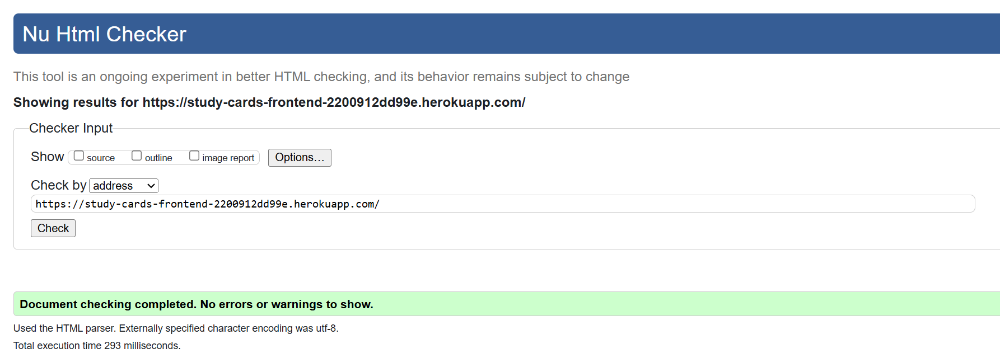

### CSS 
Below are the results of CSS validation using the [W3C CSS Validation Service](https://jigsaw.w3.org/css-validator).
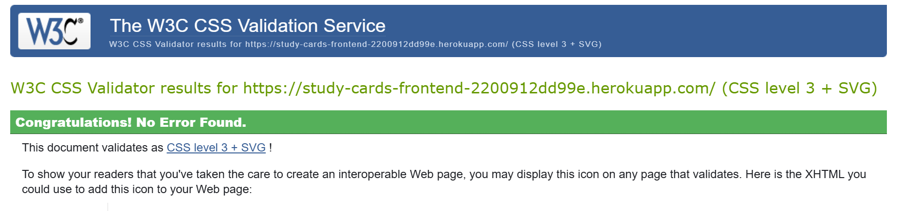
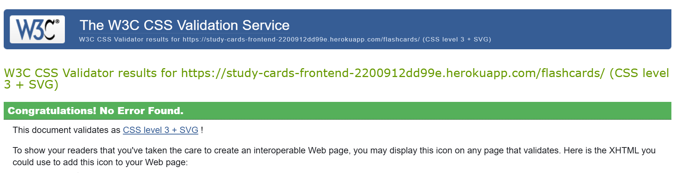
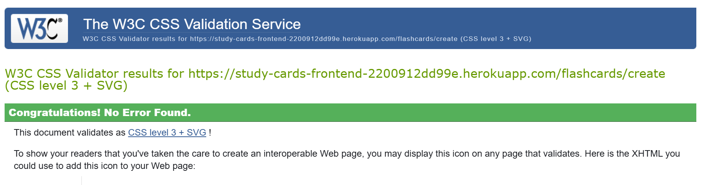
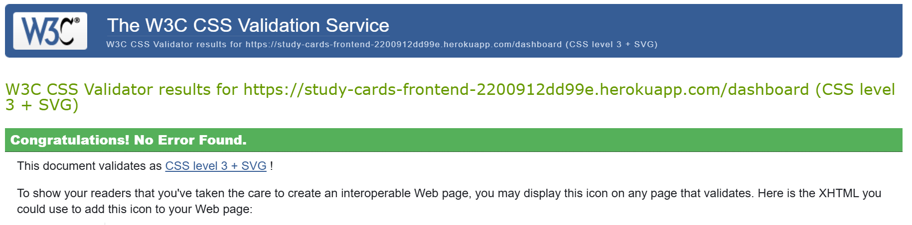
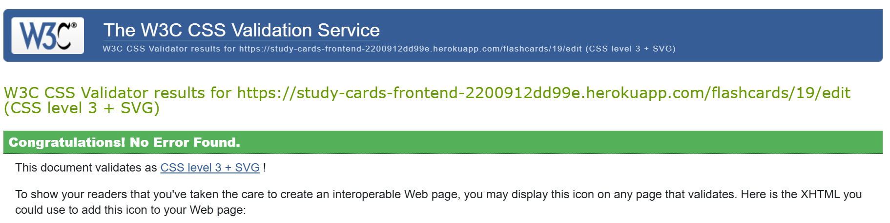
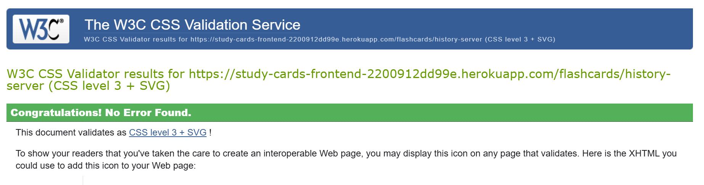
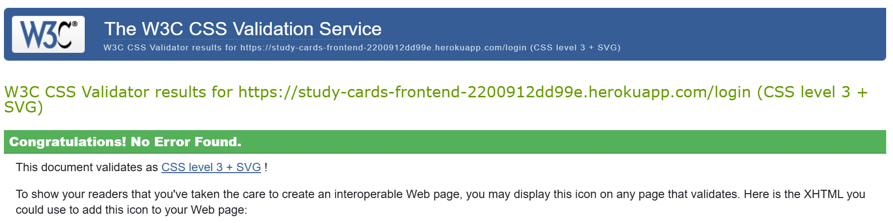
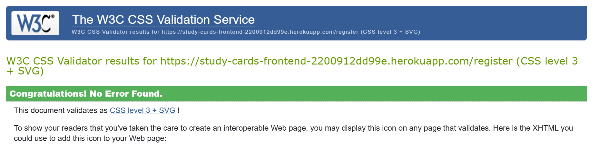
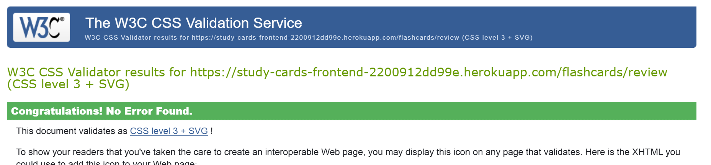

### Console
Below are the results of console output, using the Google Developer Tools, no errors have been found.

#### Dashboard Page

The website has been tested in the following browsers:

### Google Chrome

### Microsoft Edge

### Firefox

## Performance
Each page has been reviewed using [Google Lighthouse](https://developer.chrome.com/docs/lighthouse/):

Home page
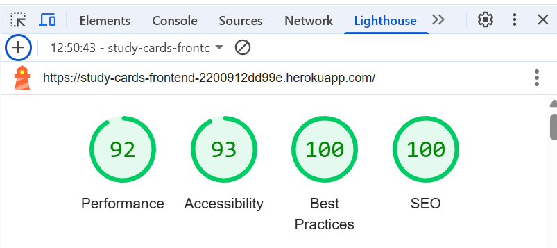
Create a card
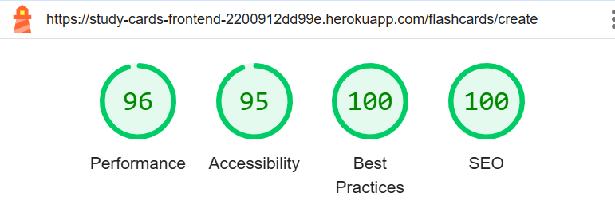
Dashboard
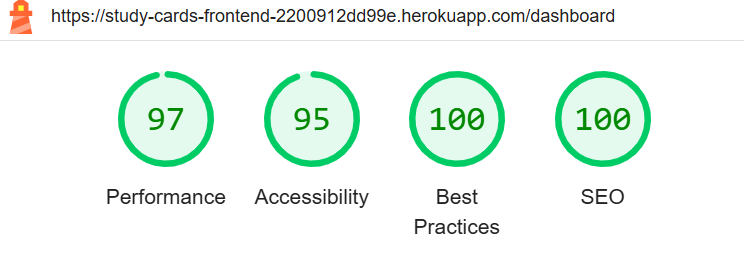
Edit Card
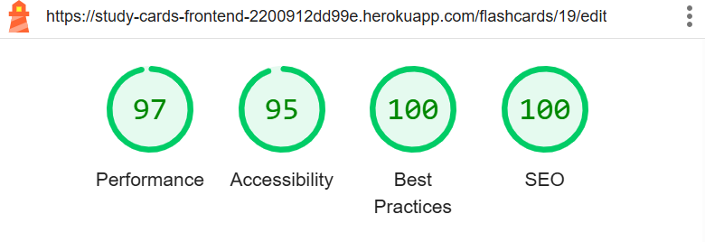
History
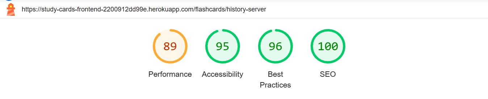
Login
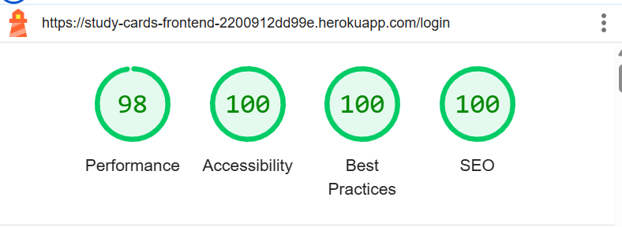
Register
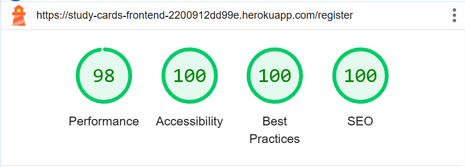
Review
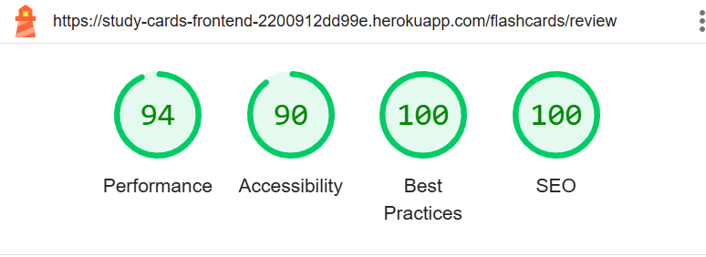

## Bugs

### Solved Bugs

| **Bug Number** | **Description**                                          | **Cause**                                                | **Solution**                                             |
|----------------|-----------------------------------------------------------|----------------------------------------------------------|----------------------------------------------------------|
| 1              | Flashcards list not updating after deleting a flashcard    | Flashcard was deleted on backend but not removed from frontend state | Updated local state after successful deletion to immediately reflect UI changes |
| 2              | Navigation bar did not update after login/logout           | Token and username changes were not triggering rerender  | Used `localStorage` correctly and adjusted component to rerender on auth state changes |
| 3              | Form error messages were not displayed on failed submissions | Form was catching errors but not rendering them properly | Added logic to map backend errors into a list and render dynamically in the UI |
| 4              | Flashcards text overflowed on small devices                | No responsive styling was applied to flashcard elements  | Added media queries to adjust font size, padding, and layout on smaller screens |
| 5              | Review flashcards component crashed if no cards were available | No check if array was empty before accessing card properties | Added conditional rendering and fallback messages when no flashcards were available |

